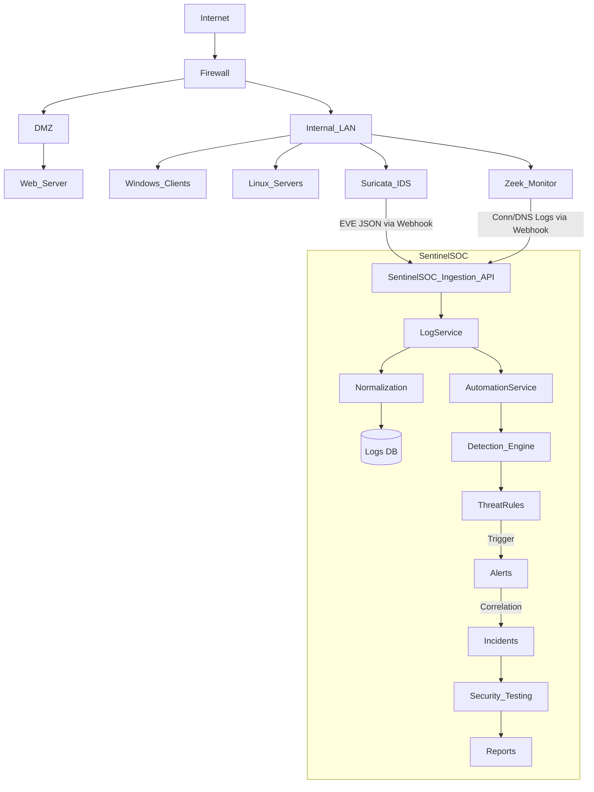

# SentinelSOC System Architecture

## 1. System Architecture Overview

SentinelSOC is a centralized Security Operations Center (SOC) designed to ingest, process, and analyze security logs from diverse network environments. The system relies on a monolithic Node.js backend acting as the API and business logic hub, with a Vanilla HTML/JS frontend rendering the UI dynamically using REST APIs. External network sensors (Suricata and Zeek) act as the primary detection engines deployed on the network edge, forwarding parsed logs to SentinelSOC for centralized correlation.

**Major Components:**
* **Frontend:** A dashboard application providing data visualization, network topology rendering, SOC workflow management, and reporting.
* **Backend:** Express.js API handling authentication, log normalization, threat rule processing, and automation.
* **Database:** MongoDB for persistent storage of models (Users, Organizations, Logs, Alerts, Incidents).
* **Analysis/Processing Services:** `LogService`, `SuricataParser`, `ZeekParser`, and the automated `AutomationService`.
* **Network Sensors:** Suricata (IDS/IPS) and Zeek (Network Monitoring).
* **Reporting:** Built-in PDF/Excel reporting modules driven by the backend data models.
* **Integrations:** Syslog and HTTP Webhook endpoints for receiving logs from external sources.

## 2. Architecture Diagram



## 3. Frontend Architecture

The frontend is a lightweight, template-based UI constructed using **Vanilla HTML, CSS, and JavaScript**. It strictly separates presentation and logic without relying on heavy frameworks (like React or Angular).

* **Technology:** HTML5, CSS3 (Custom Variables), Vanilla JavaScript.
* **Navigation:** A unified standard Sidebar (`sidebar.js`) and Top Navbar (`navbar.js`) injected and managed across all views.
* **Authentication:** Managed via JWT tokens stored in `localStorage` (`auth.js`).

**Important Pages:**
* `dashboard.html`: The Security Command Center displaying real-time metrics, Suricata/Zeek stats, and Top Attacking IPs.
* `network-topology.html`: Renders the structural relationships between organizational assets and security zones.
* `security-testing.html`: The interface for launching controlled security detection testing pipelines (Port Scan, Brute Force).
* `security-assessment.html`: Manages risk analysis and security control recommendations.
* `incidents.html`: The core workflow interface for SOC analysts to manage and investigate incidents.
* `reports.html`: The interface for generating the 16-section Network Defense compliance reports.

## 4. Backend Architecture

The backend is built on **Node.js** and **Express.js**, employing a standard Model-Route-Controller (MRC) architectural pattern.

* **Framework:** Express.js
* **Database Driver:** Mongoose (MongoDB ODM)
* **Authentication:** JWT-based stateless authentication (`authMiddleware.js`).
* **Error Handling:** Centralized error handling middleware.

**Request Flow Example (Log Ingestion):**
```text
Sensor (Suricata)
 ↓
Route: POST /api/v1/logs
 ↓
Controller: LogController.ingestLog()
 ↓
Service: LogService.processRawLog()
 ↓
Model: Log (Mongoose Schema)
 ↓
MongoDB
```

## 5. Security Event Pipeline

The core function of SentinelSOC is processing security events. The event pipeline runs asynchronously upon log ingestion:

```text
Security Source (e.g., Firewall)
 ↓
Log Source (Configured in SentinelSOC)
 ↓
Parser (SuricataParser / ZeekParser / Generic)
 ↓
Normalization (Standardizing to Common Schema)
 ↓
Log (Saved to Database)
 ↓
Detection Rule (AutomationService evaluates Log against ThreatRules)
 ↓
Alert (Created if conditions match)
 ↓
Incident (Correlated if Alert threshold is met)
```

## 6. Suricata Architecture

SentinelSOC natively supports Suricata as a premier IDS.
* **Role:** Detects network anomalies and signature matches based on network packets.
* **EVE JSON:** Suricata exports logs in the standardized EVE JSON format.
* **Supported Event Types:** `alert`, `http`, `dns`, `fileinfo`.
* **Parser:** `SuricataParser.js` extracts `event_type`, IP addresses, and `alert.signature`.
* **Detection Integration:** Normalized logs are immediately checked against Threat Rules. A Suricata `alert` log will usually trigger a high-severity SOC alert.

## 7. Zeek Architecture

SentinelSOC relies on Zeek for deep network visibility and flow analysis.
* **Role:** Monitors active connections and protocol-specific metadata.
* **Supported Log Types:** `conn.log` (connections), `dns.log` (DNS queries), `http.log`.
* **Parser:** `ZeekParser.js` parses the tab-separated or JSON Zeek logs.
* **Normalization:** Standardizes connection durations, bytes transferred, and connection states for generic pipeline processing.

## 8. Network Topology Architecture

SentinelSOC models the physical/logical network using several abstractions:
* **NetworkTopology:** The overarching document grouping nodes and edges.
* **Nodes:** Represent discrete network components (`Asset` references or generic routers/switches).
* **Edges:** Represent the physical or logical connections (traffic flows) between Nodes.
* **SecuritySensors:** Placed at strategic network boundaries (e.g., choke points) to monitor traffic traversing edges.
* **Network Zones:** Logical grouping (e.g., DMZ, Internal, Guest) assigned to assets.

## 9. Security Testing Architecture

To validate the network defense pipeline for academic and operational assurance, SentinelSOC implements a controlled testing module.

```text
Security Test (Triggered via UI)
 ↓
Controlled Event Payload (Mock Suricata JSON)
 ↓
Log Ingestion (Bypassing external network layers)
 ↓
Detection Engine Evaluates Rules
 ↓
Alert Generation
 ↓
Incident Generation
 ↓
PASS / FAIL Verification
```
*Test events are explicitly marked with `isTestEvent: true` and mapped to a `securityTestId`, preserving the logs as evidence while cleanly segregating them from production threat data.*

## 10. Deployment Architecture

SentinelSOC is designed for a localized or cloud-based SOC deployment.

```text
[ DMZ Network ]
  ├── Public Web Server
  └── External Facing Services

[ Internal Server Network ]
  ├── Suricata Sensor (Promiscuous Mode / Mirror Port)
  ├── Zeek Sensor (Promiscuous Mode / Mirror Port)
  └── [ SentinelSOC Host ]
        ├── Node.js Backend (Port 3000)
        ├── MongoDB Instance (Port 27017)
        └── Nginx Reverse Proxy (Frontend Serving)
```
*   **Network Environment:** Sensors are deployed on mirror ports or network taps to capture all traversing traffic. The SentinelSOC backend exposes an ingestion API strictly to the management network where sensors forward their parsed logs.
