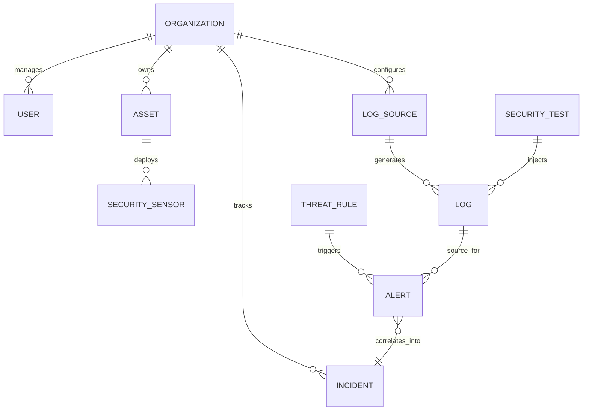

# SentinelSOC Database and API Documentation

## Part A: Database Models

SentinelSOC utilizes MongoDB and Mongoose for its data layer. The following models constitute the core architecture of the platform.

### Core Models

#### `Organization`
* **Purpose:** Multi-tenant container. All data (except super admins) belongs to an organization.

| Field | Type | Required | Reference | Description |
| --- | --- | --- | --- | --- |
| `name` | String | Yes | - | Name of the organization |
| `domain` | String | No | - | Associated domain name |
| `status` | String | No | - | active, suspended (default: active) |

#### `User`
* **Purpose:** Represents analysts and administrators accessing the system.

| Field | Type | Required | Reference | Description |
| --- | --- | --- | --- | --- |
| `organization` | ObjectId | No | Organization | Organization the user belongs to |
| `username` | String | Yes | - | Unique login name |
| `email` | String | Yes | - | Contact email |
| `password` | String | Yes | - | Bcrypt hashed password |
| `role` | ObjectId | Yes | Role | Associated RBAC Role |
| `status` | String | No | - | active, inactive (default: active) |

#### `Role`
* **Purpose:** Defines RBAC permissions for users.

| Field | Type | Required | Reference | Description |
| --- | --- | --- | --- | --- |
| `name` | String | Yes | - | Role name (e.g., SOC Manager) |
| `permissions` | Array[String] | No | - | List of assigned permission strings |

#### `Asset`
* **Purpose:** Represents monitored network devices and servers.

| Field | Type | Required | Reference | Description |
| --- | --- | --- | --- | --- |
| `organization`| ObjectId | Yes | Organization | Organization owning the asset |
| `name` | String | Yes | - | Hostname or identifier |
| `ipAddress` | String | Yes | - | IPv4/IPv6 address |
| `assetType` | String | Yes | - | server, workstation, network, iot |
| `criticality` | String | Yes | - | low, medium, high, critical |

#### `Log`
* **Purpose:** The fundamental unit of security telemetry ingested into the system.

| Field | Type | Required | Reference | Description |
| --- | --- | --- | --- | --- |
| `organization`| ObjectId | Yes | Organization | Organization context |
| `logSource` | ObjectId | Yes | LogSource | Originating sensor/service |
| `eventTime` | Date | Yes | - | Timestamp of the event |
| `eventType` | String | Yes | - | Normalized event type (e.g., SSH Login) |
| `message` | String | Yes | - | Original event payload/message |
| `sourceIP` | String | No | - | Origin IP address |
| `destinationIP`| String | No | - | Target IP address |
| `isTestEvent` | Boolean | No | - | Flag indicating injected test |
| `securityTestId`| ObjectId| No | SecurityTest | Associated test run |

#### `Alert`
* **Purpose:** Generated by the AutomationService when a ThreatRule matches a Log.

| Field | Type | Required | Reference | Description |
| --- | --- | --- | --- | --- |
| `organization`| ObjectId | Yes | Organization | Organization context |
| `title` | String | Yes | - | Alert summary |
| `severity` | String | Yes | - | low, medium, high, critical |
| `status` | String | Yes | - | new, investigating, resolved, closed |
| `sourceLog` | ObjectId | Yes | Log | The triggering log |
| `threatRule` | ObjectId | Yes | ThreatRule | The matched signature |

#### `Incident`
* **Purpose:** Correlated aggregation of Alerts requiring human investigation.

| Field | Type | Required | Reference | Description |
| --- | --- | --- | --- | --- |
| `organization`| ObjectId | Yes | Organization | Organization context |
| `title` | String | Yes | - | Incident summary |
| `severity` | String | Yes | - | Incident overall severity |
| `status` | String | Yes | - | new, assigned, investigating, closed |
| `category` | String | No | - | malware, ransomware, unauthorized_access, etc. |
| `alerts` | Array[ObjId]| No | Alert | Grouped alerts |
| `assignedTo` | ObjectId | No | User | The analyst investigating |
| `networkEvidence`| Array[Obj] | No | - | Preserved context/evidence |

#### `ThreatRule`
* **Purpose:** Evaluation rules used by the Detection Engine.

| Field | Type | Required | Reference | Description |
| --- | --- | --- | --- | --- |
| `organization`| ObjectId | Yes | Organization | Rule owner |
| `name` | String | Yes | - | Rule identifier |
| `type` | String | Yes | - | signature, anomaly, threshold |
| `category` | String | Yes | - | network, authentication, malware |
| `condition` | Mixed | Yes | - | JSON query defining the match criteria |

#### `SecurityTest`
* **Purpose:** Manages controlled network defense validation events.

| Field | Type | Required | Reference | Description |
| --- | --- | --- | --- | --- |
| `organization`| ObjectId | Yes | Organization | Organization context |
| `name` | String | Yes | - | Test scenario (e.g., Port Scan) |
| `testType` | String | Yes | - | port_scan, brute_force, malware |
| `status` | String | No | - | PENDING, PASS, FAIL |
| `payload` | Mixed | Yes | - | The raw log payload to inject |

### Database Relationships



---

## Part B: API Documentation

*All API endpoints require a valid JWT Bearer token in the `Authorization` header, except `/api/v1/auth/login`.*

### Authentication

```http
POST /api/v1/auth/login
```
**Purpose:** Authenticate user and receive a JWT.
**Required Role:** None.
**Request:**
```json
{
  "username": "admin",
  "password": "password123"
}
```
**Response:**
```json
{
  "success": true,
  "token": "eyJhbGciOi...",
  "user": { "id": "...", "role": "..." }
}
```

### Log Ingestion

```http
POST /api/v1/logs
```
**Purpose:** Primary ingestion endpoint for Suricata, Zeek, and other log sources.
**Required Role:** `ingest_logs` (Typically handled via integration tokens, falling back to user auth).
**Request:**
```json
{
  "logSourceToken": "xyz123",
  "payload": {
     "event_type": "alert",
     "src_ip": "192.168.1.100",
     "dest_ip": "10.0.0.5",
     "alert": { "signature": "Port Scan Detected" }
  }
}
```
**Response:**
```json
{
  "success": true,
  "message": "Log ingested successfully",
  "logId": "6a7cc..."
}
```

### Automation & Incident Management

```http
GET /api/v1/incidents
```
**Purpose:** Retrieve a list of correlated incidents for the SOC dashboard.
**Required Role:** `view_incidents`
**Request Parameters:** `?organization=<id>&status=new`
**Response:**
```json
{
  "success": true,
  "data": {
    "items": [
      {
        "_id": "6a7cc...",
        "title": "Brute Force Campaign",
        "severity": "high",
        "status": "new",
        "alerts": [ ... ]
      }
    ]
  }
}
```

### Network Defense Validation

```http
POST /api/v1/security-tests/run
```
**Purpose:** Execute a simulated network attack to validate the detection pipeline.
**Required Role:** `manage_security_tests`
**Request:**
```json
{
  "testId": "6a7cc..."
}
```
**Response:**
```json
{
  "success": true,
  "message": "Test executed",
  "results": {
     "logGenerated": true,
     "detectionTriggered": true,
     "incidentCreated": true,
     "evidenceRecorded": true,
     "status": "PASS"
  }
}
```

### Compliance Reports

```http
GET /api/v1/reports
```
**Purpose:** Fetch generated compliance and network defense reports.
**Required Role:** `view_reports`
**Response:**
```json
{
  "success": true,
  "data": {
    "items": [
      {
        "title": "Daily SOC Report",
        "type": "daily",
        "format": "pdf",
        "status": "completed"
      }
    ]
  }
}
```
